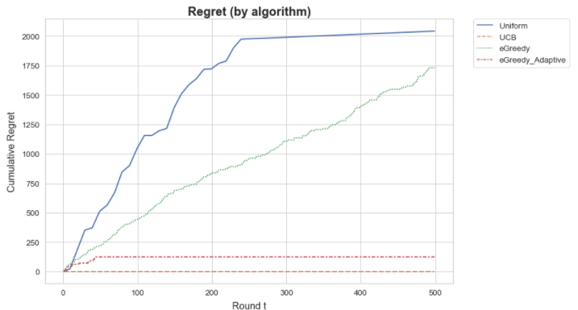

# Using Multi-armed Bandits to Determine Best Website Layout

## Overview

- This project is based on a case study of creating the most ideal website for Obama’s 2008 fundraising campaign. 
- A simulated dataset has been created to model the circumstances and test the effectiveness of various multi-armed bandit algorithms (in Python) on the task. 

## Context

- Obama's 2008 campaign team experimented with two parts of the splash page of their fundraising website: the “Media” section at the top and the call- to-action “Button”. 
- 4 buttons and 6 different media (3 images and 3 videos) were tried as below, giving a total of 24 different combinations that they could have used. 
- Each version was tested in real-time.

[*From Obama's $60 Million Dollar Experiment.*](https://www.optimizely.com/insights/blog/how-obama-raised-60-million-by-running-a-simple-experiment/)

## Objective

The objective is to figure out which website configuration out of the 24 gives the: 
 1. <b>highest sign up rate</b> (the greatest number of clicks) with the
 2. <b>least number of tries</b>.

As each 'try' represents a user visit / conversion opportunity, it is critical to ensure a balance of <b>exploration</b> to find the best configuration and <b>exploitation</b> to show the suspected best configuration as much as possible to maximize visits.

## Dataset

As the dataset models a real-life website data stream, it is not available beforehand. 

In the simulation, each website (<b>arm</b>) is shown for a specific period of time, garnering a certain amount sign ups per 100 visits (<b>reward</b>). The simulated data stream outputs a dictionary containing this information each time a website is shown (<b>pull</b>).

## Steps

As dataset is already clean, there is no pre-processing to be done.

- Implement 4 multi-armed bandit algorithms: 
    1. Uniform Exploration
    2. Epsilon-greedy
    3. Adaptive Epsilon-greedy 
    4. Upper Confidence Bound 1 (UCB1)
- Determine best website configuration
- Compare performance of algorithms with cumulative regret

## Findings

- The best algorithm to quickly converge on the best arm is UCB1
- Cumulative regret is the least (as per the graph below)
    - Lower regret (*best arm - chosen arm*) is better because it means the best arm was played most often
- Certain algorithms e.g. Uniform Exploration did not find the best arm at all

## Files

- *01_Multi_Armed_Bandit_Website_Tuning.ipynb* : Notebook detailing implementation of 4 bandit algorithms and conclusions

## Credits

The simulated dataset was provided by the National University of Singapore.

This was co-authored with Gino Martelli Tiu (@ginosytiu).